# BIỂU ĐỒ PHÂN CẤP CHỨC NĂNG (BUSINESS FUNCTION DIAGRAM - BFD)

## DỰ ÁN: HỆ THỐNG QUẢN LÝ TALENT STREAMERS (MCN PLATFORM)

Biểu đồ phân cấp chức năng (BFD - Business Function Diagram hay Functional Decomposition Diagram) mô tả cấu trúc hình cây của toàn bộ các chức năng nghiệp vụ trong hệ thống từ mức tổng quát đến chi tiết. BFD đóng vai trò là nền tảng để xây dựng Sơ đồ luồng dữ liệu (DFD) và Sơ đồ ca sử dụng (Use Case Diagram).

---

## 1. SƠ ĐỒ BFD TỔNG QUAN (MERMAID HIERARCHY TREE)

```mermaid
graph TD
    Root["HỆ THỐNG QUẢN LÝ TALENT STREAMERS<br/>(MCN PLATFORM)"]

    %% Cấp 1
    F1["1.0 QUẢN LÝ XÁC THỰC<br/>& PHÂN QUYỀN (RBAC)"]
    F2["2.0 QUẢN LÝ TALENT<br/>& MEDIA KIT"]
    F3["3.0 QUẢN LÝ BOOKING<br/>& LỊCH TRÌNH"]
    F4["4.0 QUẢN LÝ METRICS<br/>& TÍNH KPI"]
    F5["5.0 TRỢ LÝ AI<br/>RECOMMENDATION"]
    F6["6.0 BÁO CÁO &<br/>QUẢN TRỊ HỆ THỐNG"]

    Root --> F1
    Root --> F2
    Root --> F3
    Root --> F4
    Root --> F5
    Root --> F6

    %% Cấp 2: F1
    F1 --> F11["1.1 Đăng ký tài khoản Client"]
    F1 --> F12["1.2 Đăng nhập & Xác thực phiên"]
    F1 --> F13["1.3 Quản lý hồ sơ cá nhân"]
    F1 --> F14["1.4 Phân quyền truy cập 4 vai trò"]
    F1 --> F15["1.5 Đăng xuất an toàn"]

    %% Cấp 2: F2
    F2 --> F21["2.1 Khám phá & Bộ lọc Talent"]
    F2 --> F22["2.2 Xem Talent Media Kit chi tiết"]
    F2 --> F23["2.3 Cập nhật hồ sơ Streamer"]
    F2 --> F24["2.4 Xem thống kê nền tảng"]
    F2 --> F25["2.5 Quản lý trạng thái hoạt động"]

    %% Cấp 2: F3
    F3 --> F31["3.1 Khách hàng tạo yêu cầu Booking"]
    F3 --> F32["3.2 Kiểm tra xung đột lịch trình trực tiếp"]
    F3 --> F33["3.3 Manager phê duyệt / từ chối Booking"]
    F3 --> F34["3.4 Tự động khóa lịch phát sóng"]
    F3 --> F35["3.5 Quản lý lịch cá nhân Streamer"]
    F3 --> F36["3.6 Cập nhật trạng thái hoàn thành"]

    %% Cấp 2: F4
    F4 --> F41["4.1 Upload & Parse file CSV số liệu"]
    F4 --> F42["4.2 Kiểm tra tính hợp lệ số liệu"]
    F4 --> F43["4.3 Thiết lập mục tiêu KPI định kỳ"]
    F4 --> F44["4.4 Tự động cộng dồn giờ & doanh thu"]
    F4 --> F45["4.5 Trực quan hóa tiến độ bằng biểu đồ"]

    %% Cấp 2: F5
    F5 --> F51["5.1 Tiếp nhận yêu cầu tư vấn tự nhiên"]
    F5 --> F52["5.2 Context Injection từ CSDL Talent"]
    F5 --> F53["5.3 Tích hợp LLM API (Gemini / OpenAI)"]
    F5 --> F54["5.4 Thuật toán Heuristic Scoring Fallback"]
    F5 --> F55["5.5 Gợi ý Talent Card & Link Booking"]

    %% Cấp 2: F6
    F6 --> F61["6.1 Dashboard thống kê tổng quan sàn"]
    F6 --> F62["6.2 Báo cáo doanh thu & hoa hồng MCN (15%)"]
    F6 --> F63["6.3 Phân bổ Streamer cho Manager"]
    F6 --> F64["6.4 Quản lý tài khoản toàn hệ thống"]
```



---

## 2. MA TRẬN PHÂN RÃ CHỨC NĂNG NGHIỆP VỤ CHI TIẾT

### Nhóm 1.0: Quản Lý Xác Thực & Phân Quyền (RBAC)
Mục tiêu: Đảm bảo an ninh và phân định quyền hạn chính xác giữa 4 nhóm đối tượng: Admin, Manager, Streamer, Client.
- **1.1 Đăng ký tài khoản:** Cho phép đối tác / nhãn hàng (Client) tự đăng ký tài khoản tham gia hệ thống.
- **1.2 Đăng nhập & Xác thực:** Xác thực thông tin qua email & mật khẩu bảo mật (bcrypt), khởi tạo phiên làm việc bảo vệ chống CSRF.
- **1.3 Quản lý hồ sơ cá nhân:** Xem và chỉnh sửa thông tin liên hệ, ảnh đại diện, số điện thoại.
- **1.4 Phân quyền truy cập 4 vai trò:** Middleware `CheckRole` kiểm soát chặt chẽ URL và tính năng theo vai trò người dùng.
- **1.5 Đăng xuất:** Hủy phiên làm việc an toàn và xóa token xác thực.

### Nhóm 2.0: Quản Lý Talent & Media Kit
Mục tiêu: Xây dựng bộ mặt chuyên nghiệp của MCN, giới thiệu thế mạnh của từng Streamer tới các nhãn hàng.
- **2.1 Khám phá & Bộ lọc Talent:** Tìm kiếm streamer theo từ khóa, lọc theo thể loại (Gaming, Review, Lifestyle, Just Chatting), khoảng giá thuê và lượt view.
- **2.2 Xem Talent Media Kit:** Trang Press Kit điện tử hiển thị tỷ lệ tương tác, avg/peak viewers, tổng số giờ phát sóng và danh sách hợp đồng tiêu biểu.
- **2.3 Cập nhật hồ sơ Streamer:** Dành cho Streamer và Manager cập nhật tiểu sử (Bio), mức giá thuê/giờ, kênh liên kết (YouTube, Twitch, TikTok, Facebook).
- **2.4 Xem thống kê nền tảng:** Phân tích tỷ trọng người theo dõi và lượt xem trên từng mạng xã hội.
- **2.5 Quản lý trạng thái hoạt động:** Admin/Manager có thể chuyển đổi trạng thái Talent giữa `active` (sẵn sàng nhận việc) và `suspended` (tạm nghỉ).

### Nhóm 3.0: Quản Lý Booking & Lịch Trình (Collision-Free)
Mục tiêu: Tự động hóa quy trình đặt lịch biểu diễn giữa Nhãn hàng và Talent, loại trừ 100% tình trạng trùng lịch.
- **3.1 Tạo yêu cầu Booking:** Client điền form chọn Talent, khoảng thời gian (Start Time -> End Time), mục tiêu chiến dịch và ngân sách dự kiến.
- **3.2 Kiểm tra xung đột lịch trình (Live Collision Check):** API kiểm tra thuật toán giao thoa khoảng thời gian `(StartA < EndB) AND (EndA > StartB)` ngay khi Client vừa chọn giờ.
- **3.3 Manager phê duyệt / từ chối:** Quản lý xem danh sách đơn chờ duyệt, đánh giá tính khả thi và duyệt hợp đồng.
- **3.4 Tự động khóa lịch:** Khi đơn được duyệt, hệ thống tự động chèn một bản ghi loại `booking` vào bảng `schedules` trong Database Transaction.
- **3.5 Quản lý lịch cá nhân Streamer:** Streamer chủ động đăng ký các khung giờ bận cá nhân (`busy`) để nhãn hàng không đặt trùng.
- **3.6 Cập nhật hoàn thành:** Chuyển trạng thái booking sang `completed` sau khi sự kiện kết thúc thành công.

### Nhóm 4.0: Quản Lý Số Liệu (Metrics) & Đánh Giá KPI
Mục tiêu: Đánh giá định lượng hiệu suất phát sóng và theo dõi tiến độ cam kết hợp đồng.
- **4.1 Upload & Parse file CSV:** Manager tải lên file CSV ghi nhận dữ liệu hàng trăm buổi livestream.
- **4.2 Kiểm tra tính hợp lệ số liệu:** Validate định dạng ngày tháng, số view dương, tính toán số giờ stream thực tế.
- **4.3 Thiết lập mục tiêu KPI:** Manager giao chỉ tiêu hàng tháng/quý cho từng Streamer (số giờ live tối thiểu, doanh thu kỳ vọng).
- **4.4 Tự động cộng dồn KPI:** Hệ thống tính toán tổng giờ live từ bảng `stream_metrics` và tổng doanh thu từ `bookings` đã thanh toán, cập nhật tỷ lệ hoàn thành `%`.
- **4.5 Trực quan hóa tiến độ:** Biểu đồ Chart.js thể hiện xu hướng tăng trưởng view và thanh đo tiến độ đạt KPI.

### Nhóm 5.0: Trợ Lý AI Cố Vấn Booking (AI Recommendation)
Mục tiêu: Hỗ trợ nhãn hàng tìm kiếm streamer tối ưu chỉ bằng các câu hỏi thông thường.
- **5.1 Tiếp nhận yêu cầu tự nhiên:** Chatbot widget nhận các truy vấn như *"Tìm cho tôi streamer game tầm giá dưới 2 triệu"*.
- **5.2 Context Injection (RAG):** Rút trích danh sách Talent thực tế và các chỉ số hoạt động trong CSDL làm dữ liệu nền tảng.
- **5.3 Tích hợp LLM API:** Gửi câu hỏi kèm dữ liệu ngữ cảnh đến Google Gemini 1.5 Flash hoặc OpenAI GPT-3.5 Turbo.
- **5.4 Thuật toán Heuristic Scoring Fallback:** Tự động nhận diện ngân sách (Regex) và phân loại thể loại bằng ma trận chấm điểm nội bộ nếu không có internet/API key.
- **5.5 Gợi ý Talent Card:** Trả về câu tư vấn lịch sự kèm danh thiếp thu nhỏ và nút dẫn thẳng đến trang Media Kit của Talent.

### Nhóm 6.0: Báo Cáo & Quản Trị Hệ Thống Toàn Sàn
Mục tiêu: Giúp Ban Giám đốc MCN nắm bắt toàn bộ hoạt động kinh doanh và vận hành mạng lưới.
- **6.1 Dashboard tổng quan:** Thống kê tổng số Talent, số hợp đồng booking thành công, tổng giờ phát sóng và lượt tương tác toàn sàn.
- **6.2 Báo cáo doanh thu & Hoa hồng Agency:** Tự động tính toán tổng giá trị hợp đồng và 15% hoa hồng giữ lại cho công ty MCN.
- **6.3 Phân bổ Streamer cho Manager:** Admin gán quyền quản lý từng nhóm streamer cho từng Manager chuyên trách.
- **6.4 Quản lý tài khoản toàn sàn:** Admin kiểm soát danh sách người dùng, kích hoạt hoặc khóa tài khoản vi phạm chính sách.

---

## 3. MỐI QUAN HỆ GIỮA BFD VÀ CÁC BIỂU ĐỒ KHÁC

```
[ BFD: Biểu đồ phân cấp chức năng ]
   │
   ├──> Trả lời câu hỏi: "Hệ thống có những chức năng gì?"
   │
   ├──> [ DFD: Sơ đồ luồng dữ liệu ]
   │      - Mỗi chức năng lá (Cấp 2) của BFD tương ứng với 1 Tiến trình (Process) trong DFD.
   │      - Bổ sung: Luồng vào, luồng ra và kho lưu trữ dữ liệu.
   │
   └──> [ Use Case Diagram: Sơ đồ ca sử dụng ]
          - Mỗi chức năng lá của BFD kết hợp với Tác nhân (Actor) tạo thành 1 Use Case hoàn chỉnh.
```
