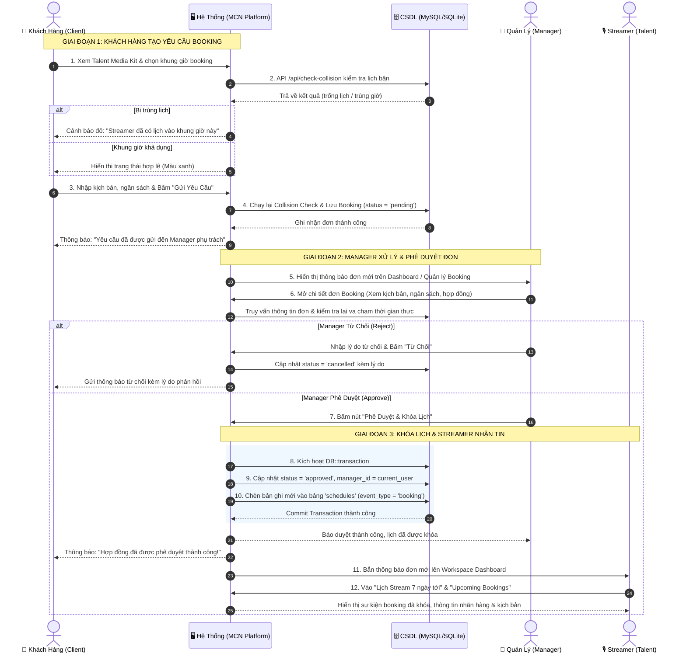
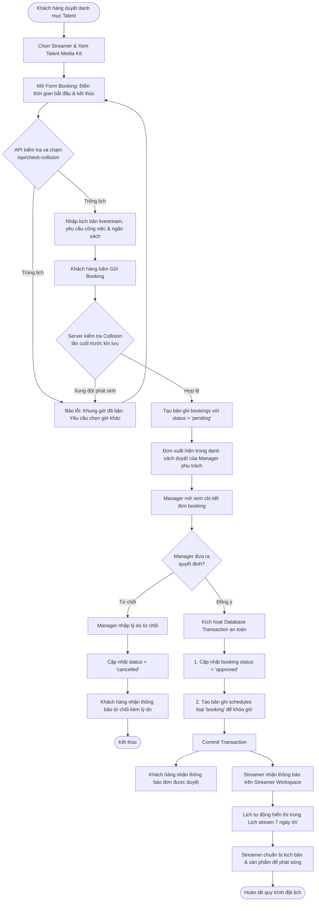

# QUY TRÌNH NGHIỆP VỤ BOOKING (BOOKING WORKFLOW & COLLISION-FREE)

## DỰ ÁN: HỆ THỐNG QUẢN LÝ TALENT STREAMERS (MCN PLATFORM)

Tài liệu này mô tả chi tiết luồng hoạt động từ lúc **Khách hàng (Client)** vào đặt lịch, **Quản lý (Manager)** tiếp nhận xử lý và **Streamer (Talent)** nhận thông báo cập nhật lịch phát sóng.

---

## 1. SƠ ĐỒ LUỒNG HOẠT ĐỘNG PHÂN LÀN (SWIMLANE ACTIVITY DIAGRAM)

---

## 2. LƯU ĐỒ QUY TRÌNH RA QUYẾT ĐỊNH (FLOWCHART LOGIC)

---

## 3. CƠ CHẾ BẢO MẬT & TOÀN VẸN DỮ LIỆU ĐÃ CÀI ĐẶT TRONG CODE

1. **Kiểm tra va chạm 2 lớp (Two-tier Collision Detection):**
   - **Tầng Client (AJAX):** Kiểm tra tức thì khi đổi `datetime` để nâng cao trải nghiệm người dùng (UX).
   - **Tầng Server (BookingController + BookingCollisionService):** Ngăn chặn hoàn toàn việc bypass form hoặc gửi request trực tiếp bằng Postman/Curl.
2. **Database Transaction:**
   - Quá trình chuyển trạng thái booking sang `approved` và việc tạo lịch trình mới trong bảng `schedules` được bọc trong `DB::transaction()`. Nếu có lỗi xảy ra ở bất kỳ bước nào, toàn bộ sẽ tự động Rollback, bảo đảm không bao giờ xảy ra tình trạng "đơn đã duyệt nhưng lịch chưa khóa".
3. **Phân quyền chặt chẽ (RBAC + IDOR Protection):**
   - Chỉ Manager phụ trách trực tiếp Streamer đó (hoặc Admin tối cao) mới có quyền bấm **Phê duyệt** hoặc **Từ chối**.
   - Streamer chỉ xem được thông tin booking của chính bản thân mình.
