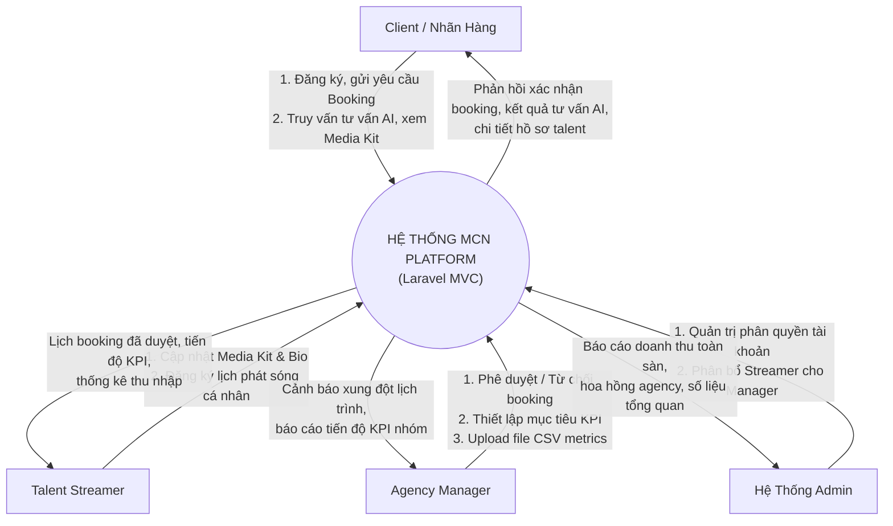
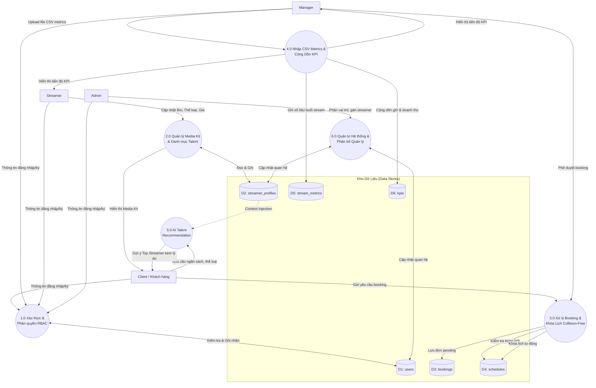

# SƠ ĐỒ LUỒNG DỮ LIỆU (DATA FLOW DIAGRAM - DFD)

## 1. DFD CẤP 0 (CONTEXT DIAGRAM - SƠ ĐỒ NGỮ CẢNH)

Hệ thống Quản lý Talent Streamers (MCN Platform) tương tác với 4 tác nhân chính: **Admin**, **Manager**, **Streamer**, và **Client / Khách vãng lai**.

---

## 2. DFD CẤP 1 (SƠ ĐỒ PHÂN RÃ CHỨC NĂNG)

Phân rã hệ thống thành 6 tiến trình nghiệp vụ cốt lõi:

