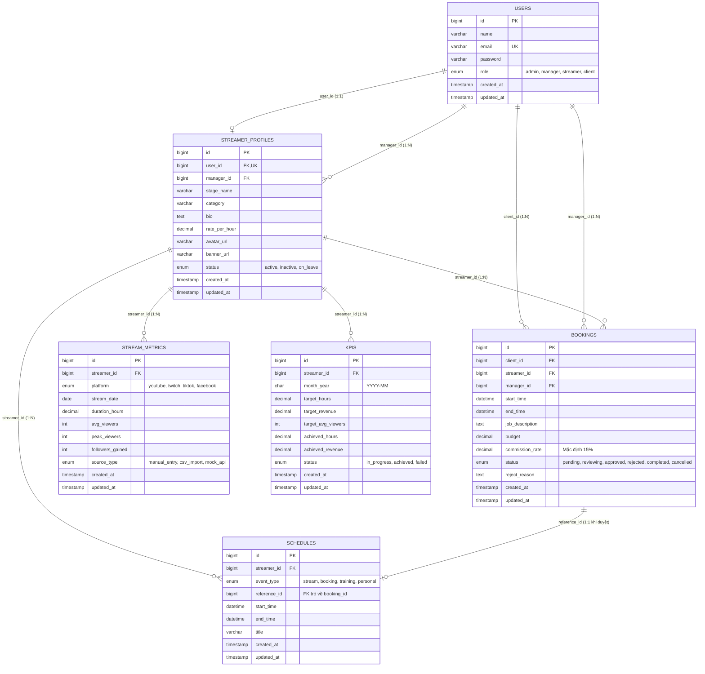

# SƠ ĐỒ THỰC THỂ LIÊN KẾT (ENTITY RELATIONSHIP DIAGRAM - ERD)

## 1. SƠ ĐỒ QUAN HỆ THỰC THỂ (ERD)

---

## 2. TỪ ĐIỂN DỮ LIỆU (DATA DICTIONARY)

### 2.1 Bảng `users`
Lưu trữ thông tin tài khoản người dùng của toàn bộ 4 vai trò trong hệ thống.
- `id`: Khóa chính (BigInt, Auto Increment).
- `name`: Tên đầy đủ hoặc tên đại diện tổ chức.
- `email`: Địa chỉ email duy nhất đăng nhập.
- `password`: Mật khẩu được mã hóa bằng thuật toán Bcrypt.
- `role`: Vai trò người dùng (`admin`, `manager`, `streamer`, `client`).

### 2.2 Bảng `streamer_profiles`
Hồ sơ công khai (Media Kit / Press Kit) của các Creator.
- `user_id`: Khóa ngoại 1:1 liên kết với tài khoản `users`.
- `manager_id`: Khóa ngoại N:1 liên kết với tài khoản Manager phụ trách.
- `stage_name`: Nghệ danh phát sóng.
- `category`: Thể loại nội dung chính (Gaming, Just Chatting, Review, Lifestyle...).
- `rate_per_hour`: Giá tham khảo cho mỗi giờ livestream hợp tác.
- `status`: Trạng thái hoạt động (`active`, `inactive`, `on_leave`).

### 2.3 Bảng `bookings`
Hợp đồng yêu cầu hợp tác giữa nhãn hàng và Streamer.
- `client_id`: Khách hàng tạo yêu cầu.
- `streamer_id`: Talent được chọn.
- `manager_id`: Quản lý phụ trách duyệt.
- `start_time` & `end_time`: Khung giờ livestream được đề xuất.
- `budget`: Tổng chi phí nhãn hàng trả.
- `commission_rate`: Tỷ lệ hoa hồng trích xuất cho MCN (mặc định 15%).
- `status`: Tiến trình duyệt (`pending` -> `reviewing` -> `approved`/`rejected` -> `completed`).

### 2.4 Bảng `schedules`
Lịch tổng hợp phục vụ thuật toán phát hiện và ngăn chặn xung đột (Collision-Free).
- `event_type`: Loại sự kiện (`stream`, `booking`, `training`, `personal`).
- `reference_id`: Khóa liên kết trỏ về `bookings.id` nếu là lịch được tạo do duyệt booking.
- `start_time` & `end_time`: Thời gian diễn ra sự kiện.

### 2.5 Bảng `stream_metrics`
Số liệu đo lường từng buổi livestream được import từ file CSV hoặc nhập tay.
- `platform`: Kênh phát sóng (`youtube`, `twitch`, `tiktok`, `facebook`).
- `duration_hours`: Số giờ stream thực tế.
- `avg_viewers` & `peak_viewers`: Lượng khán giả xem đồng thời.
- `followers_gained`: Số lượng người theo dõi mới tăng thêm.

### 2.6 Bảng `kpis`
Chỉ tiêu đánh giá hiệu quả hàng tháng của Streamer do Manager thiết lập.
- `month_year`: Tháng áp dụng theo định dạng `YYYY-MM`.
- `target_hours` & `target_revenue`: Mục tiêu giờ stream và doanh thu cần đạt.
- `achieved_hours` & `achieved_revenue`: Số liệu thực tế được tự động cộng dồn sau mỗi lần import CSV metrics hoặc hoàn thành booking.
